# LasS0 <!-- omit in toc -->

# Contents <!-- omit in toc -->

- [Buying](#buying)
- [What is this?](#what-is-this)
- [Usage](#usage)
  - [Jumpers:](#jumpers)
- [Firmware](#firmware)
- [Performance](#performance)
  - [New AVR version](#new-avr-version)
    - [0-5V DC pulses, 10Hz, 10ms pulse length](#0-5v-dc-pulses-10hz-10ms-pulse-length)
    - [Shortest stable input pulse - 150ns](#shortest-stable-input-pulse---150ns)
    - [Rise time / delay 100µs](#rise-time--delay-100µs)
    - [5_10_i_r firmware example](#5_10_i_r-firmware-example)
  - [Old S8050 / FET version](#old-s8050--fet-version)
    - [0-5V DC pulses, 50Hz, 5ms pulse length](#0-5v-dc-pulses-50hz-5ms-pulse-length)
    - [Rise time 33µs, Fall time 1µs](#rise-time-33µs-fall-time-1µs)
    - [Switch on delay 66µs](#switch-on-delay-66µs)
    - [Switch off delay 5µs](#switch-off-delay-5µs)
    - [TCRCT5000 with "normal" non inverted configuration](#tcrct5000-with-normal-non-inverted-configuration)
    - [TCRCT5000 with "inverted" configuration](#tcrct5000-with-inverted-configuration)
- [3D printing](#3d-printing)

# Buying

Keep an eye out on the Tindie store, where leftover boards will be sold and are currently awaiting approval!

If you like my work please consider supporting my caffeine addiction!

# What is this?

This is a logic level impulse to S0 converter/interface board. It is used to convert 5v logic level impulses to an S0 compatible format to use sensors like the TCRT5000 reflective optical sensor in existing smart home systems, that usually use 12v or 24v levels for digital inputs. This can be used to read out old school electrical meters as well as modern smart meters that only offer optical IR impulses or a spinning disc to "display" the current power usage.

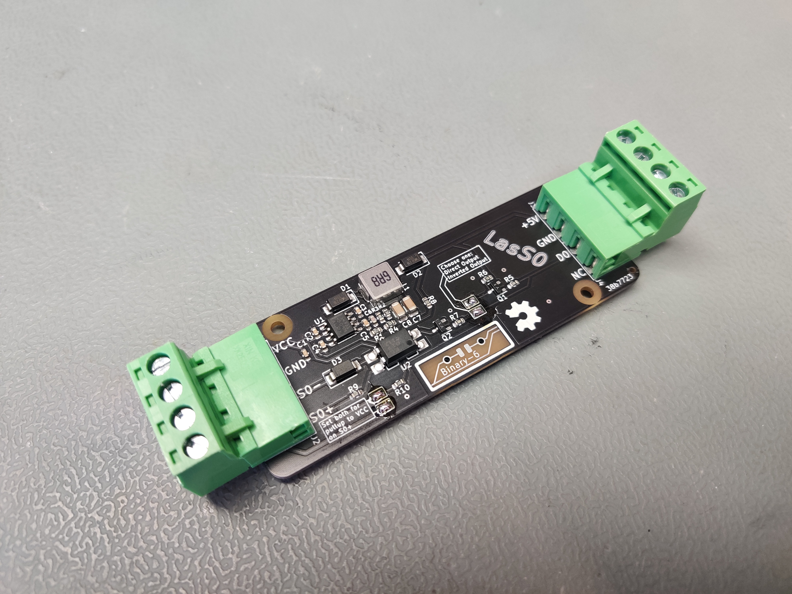

There are 'two versions' of the board included. LasS0_FET uses a FET input stage. The included gerbers are NOT tested and probably won't be. The initial NPN input stage version however was ordered and tested working.
The other, more recent version uses an AVR microcontroller as the input stage, specifically providing pulse extension and pulse division between the input and the S0 output. This was neccessary for me since my electricity meter outputs 10,000 imp/kWh with only a pulselength of about 7ms, which my smart home controller could not read. It required pulses of at least 15ms to reliably detect every pulse. The AVR counts a set number of input pulses and outputs a fixed output pulse once enough inputs have been counted. In my case I divide 10:1 and output a 30ms pulse after every 10 input pulses, changing the total resolution of my specific meter to 1,000 imp/kwh.

The AVR board additionaly breaks out all unused portpins to pinheaders as well as the AO screw terminal so you could theoretically read out the analog value of a TCRT5000 as well.

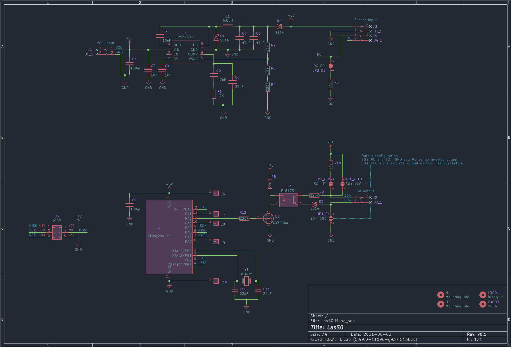

# Usage

The device needs to be powered through `J1` with 12-24v.

One of the upper jumpers needs to be set to choose between `Direct` and `Inverted` which would invert the output fully. If no jumper is set you won't get any output. If both jumpers are set you are going to have a bad time.

A 5v logic level impulse input such as the output of a TCRT5000 can be connected to `J3/J4` at `D0`, which is then output to `J2` as an `S0` compatible open collector signal through the optocoupler.

## Jumpers:

The following jumpers need to be configured to your usecase. Without setting anything, you will get an open S0 output without any pullup/downs on the inputs or outputs.

- `S0+ - VCC` - connects `S0+` to `VCC`, allowing VCC pulses to be output on `S0-`
- `S0+ - PU_VCC` - connects `S0+` to `VCC` via a 10K pullup.
- `S0- - GND` - connects `S0-` to `GND`,  can be used with `S0+ - PU_VCC` to have 24 V logic pulses on `S0+`, which is how I use it for Loxone inputs
- `D0-PD_GND` - connects a 10K pulldown to the D0 input. The AVR only has included pullups on the input port so if your application needs a pulldown it can be enabled on the board. Pullups can be enabled in firmware.

Additionally `PA1`, `PA3`, `PA7` as well as `5V` and `GND` are broken out to pin headers, the `ICSP` port is fully exposed to pin headers, and `PA0` is exposed to the `A0` screw terminal, enabling analog inputs as well.

# Firmware

To translate any type of input pulse to any type of output pulse an Attiny24a is used. The firmware is done in C but built in PlatformIO. The project can be found in the `firmware/Platformio` folder. To compile and upload, you will need to choose one of the build environments as `default` will compile and upload all build configurations one after the other.

If you don't wanna compile yourself, there are several prebuild binaries for different configurations of input and output pulses. Find them in the `firmware/builds` directory.
This directory contains  .elf and .hex files for every environment.

The naming structure for the environments is as follows:

`tinyWW_XXX_Y_Z`

- `W` = Divider ratio
- `X` = Output pulse length
- `Y` = `r` for rising edge input, `f` for falling edge input
- `Z` = `i` for inverted output, `n` for non-inverted output

So:
- `tiny10_30_n_r` generates a `30 ms` `positive` output pulse for every `10` `rising edges` on the input
- `tiny5_250_i_f` generates a `250ms` `negative` output pulse for every `5` `falling edges` on the input

The firmware is uploaded via `ICSP`.

# Performance

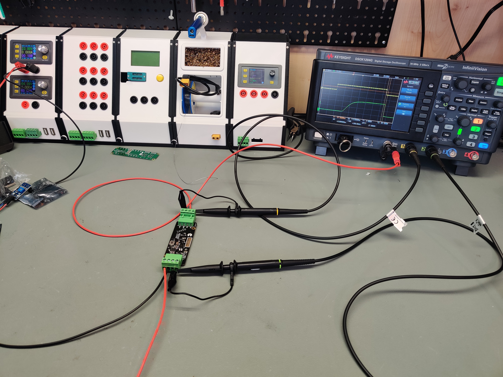

The device was tested, on a 23 V supply with 5 V test pulses from a function gen as well as the TCRT5000.
## New AVR version

This version uses the high input impedance of the ATTINY inputs, reducing required input current significantly, not loading your input sensor at all. The following measurements / demonstrations were done with the `AVR` board, PCB version 788734e, with the `S0+ - PU_VCC` and `S0- - GND` jumpers set, setting a pullup to `SO+` and connecting `S0-` to ground. `Channel 1` is the function gen output, `Channel 2` is measuring the pulled up `S0+`. 

The firmware version used is 1_10_n_r, outputting a 10ms non-inverted output pulse for every rising edge on the input.

### 0-5V DC pulses, 10Hz, 10ms pulse length

10ms input pulses being translated to 10ms output pulses, just shifting levels.

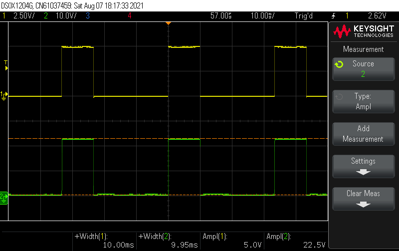

### Shortest stable input pulse - 150ns

The shortest input pulse that is stable to detect is about 150ns long at 5V. The device still outputs a 10ms output pulse.

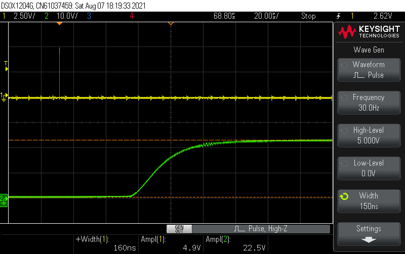

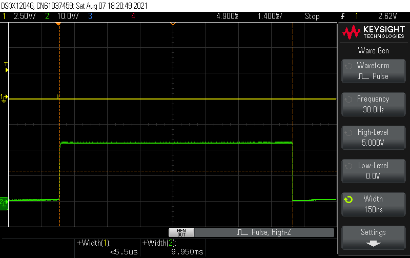

### Rise time / delay 100µs

Looking only at the switch on time the device needs about 100µs to fully switch on the output after detecting a rising edge on the input.

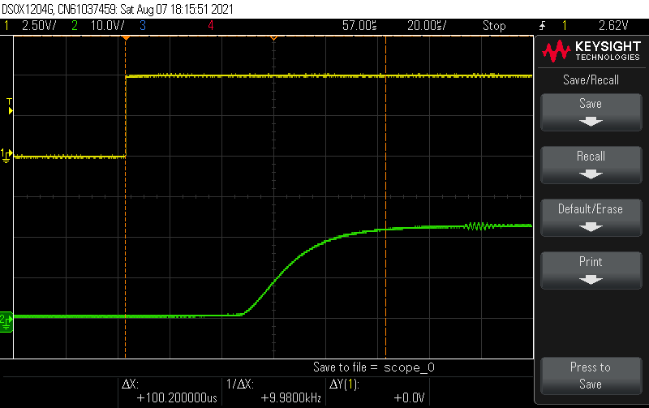

### 5_10_i_r firmware example

The following screenshot is a demonstration of the 5_10_i_r firmware, outputting a 10ms inverted output pulse for every 5 edges on the input.

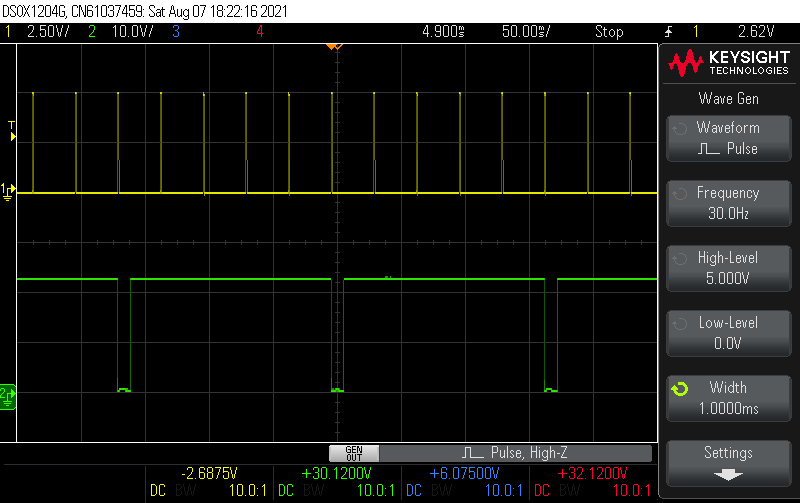

## Old S8050 / FET version

The version that was tested needs around 6mA of current on the DO input to drive the input stage. My TCRT5000 module is only able to deliver about 1mA somehow so the channel 1 voltage with the TCRT5000 drops significantly but the output is still fully driven. Currently ordering some new TCRT5000 to see why the comparator can only drive such low currents. 

The same measurements have been done with the FET version using AO34000A MOSFETs, removing the high input current but otherwise providing almost identical outputs (mostly limited by the output optocoupler, which explains the similar results).

The following measurements / demonstrations were done with the S8050 input stage, PCB revision 38b7723, with the S0 pullup jumpers set:

### 0-5V DC pulses, 50Hz, 5ms pulse length

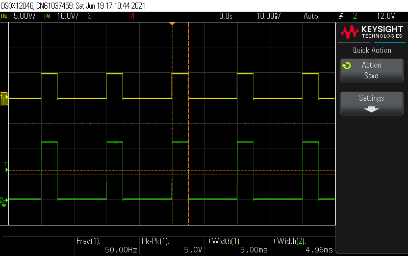

### Rise time 33µs, Fall time 1µs

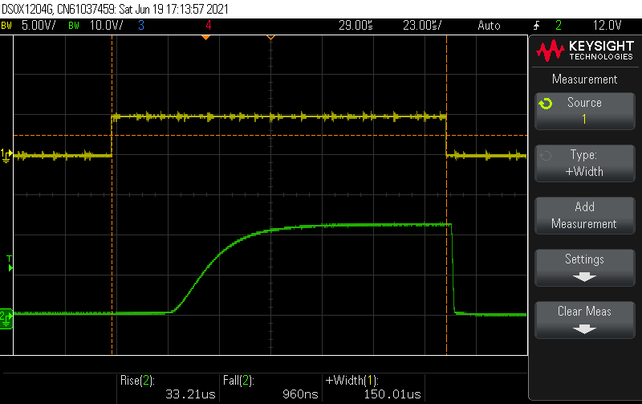

### Switch on delay 66µs

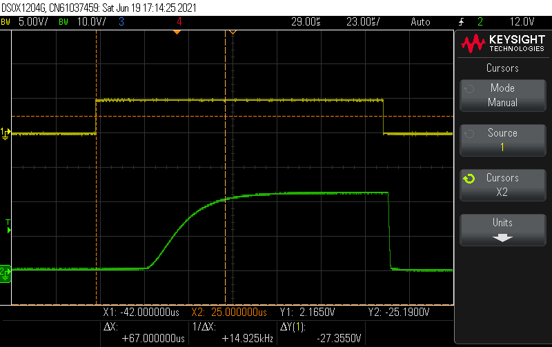

### Switch off delay 5µs

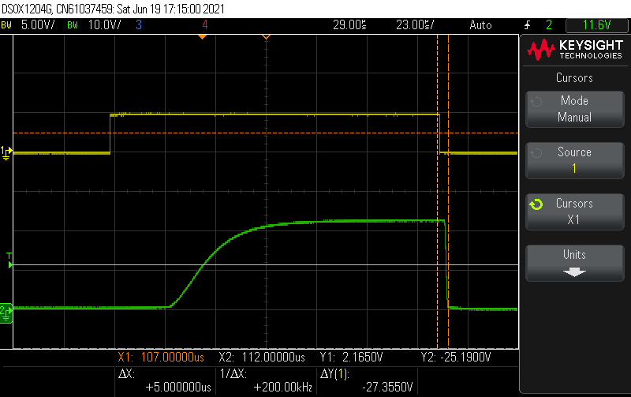

### TCRCT5000 with "normal" non inverted configuration

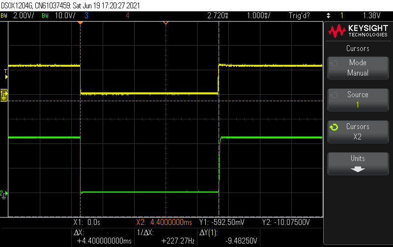

### TCRCT5000 with "inverted" configuration

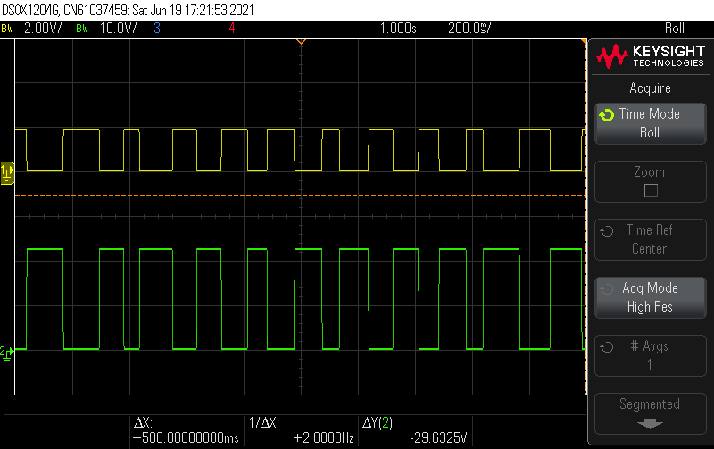

# 3D printing

Considering this is meant to go inside your electrical cabinet it is best printed in PC or ABS and not PLA.

There is a 3D printable DIN rail case for the LasS0 PCB itself, as well as a readhead to attach a TCRT5000 module to EMH eHZ readers (which is what I am using this whole project for).

The case incorporates DIN rail clamps, remixed from a cable clamp by mdkendall, [check it out here!](https://www.thingiverse.com/thing:2613804).

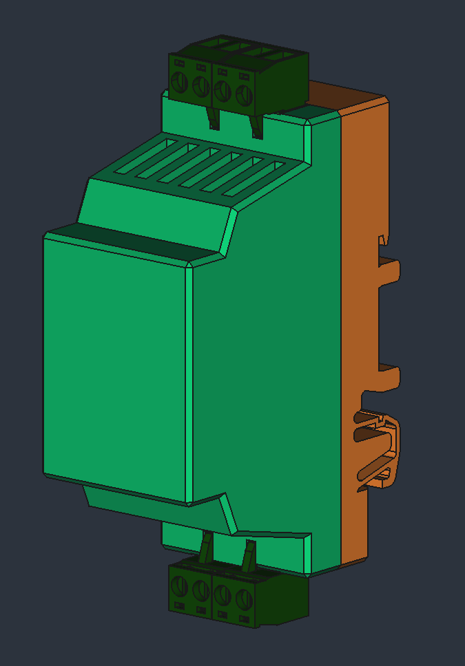

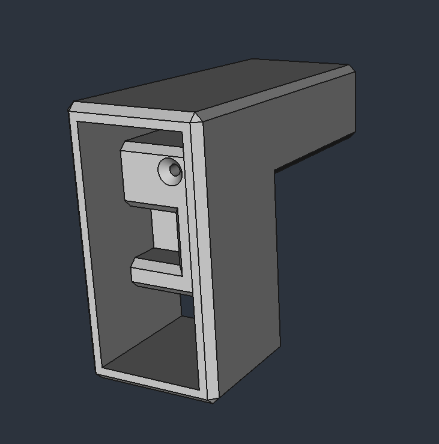
