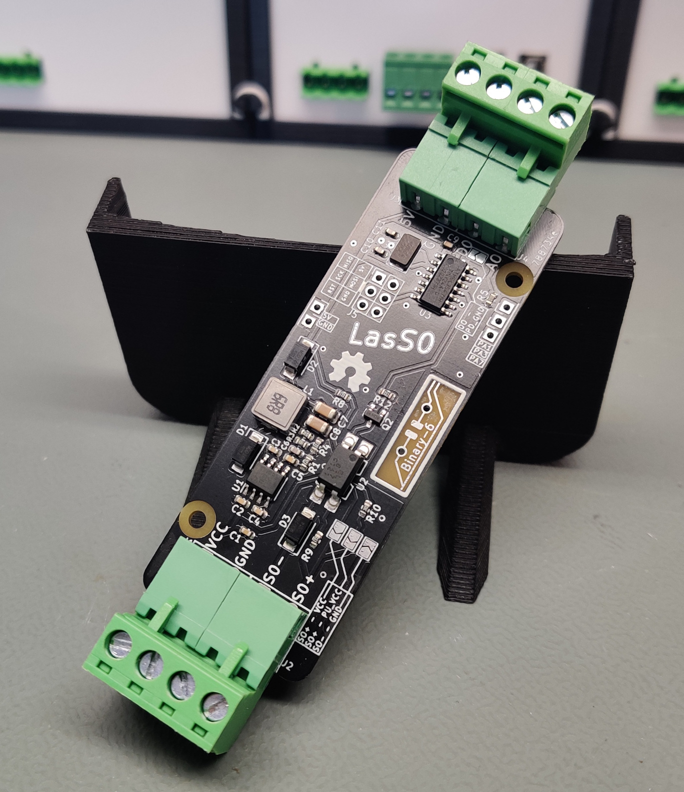

# LasS0 <!-- omit in toc -->

# WARNING <!-- omit in toc -->

This board is not yet tested and is currently being manufactured. This information will be removed once the PCB is tested working. The 3D printed case will be designed once the boards arrive.

# Contents <!-- omit in toc -->

- [Buying](#buying)
- [What is this?](#what-is-this)
- [Usage](#usage)
- [Performance](#performance)
    - [0-5V DC pulses, 50Hz, 5ms pulse length](#0-5v-dc-pulses-50hz-5ms-pulse-length)
    - [Rise time 33µs, Fall time 1µs](#rise-time-33µs-fall-time-1µs)
    - [Switch on delay 66µs](#switch-on-delay-66µs)
    - [Switch off delay 5µs](#switch-off-delay-5µs)
    - [TCRCT5000 with "normal" non inverted configuration](#tcrct5000-with-normal-non-inverted-configuration)
    - [TCRCT5000 with "inverted" configuration](#tcrct5000-with-inverted-configuration)
- [3D printing](#3d-printing)

# Buying

Keep an eye out on the Tindie store, where leftover boards will be sold!

# What is this?

This is a logic level impulse to S0 converter/interface board. It is used to convert 5v logic level impulses to an S0 compatible format to use sensors like the TCRT5000 reflective optical sensor in existing smart home systems, that usually use 12v or 24v levels for digital inputs. This can be used to read out old school electrical meters as well as modern smart meters that only offer optical IR impulses or a spinning disc to "display" the current power usage.

# Usage

The device needs to be powered through `J1` with 12-24v.

One of the upper jumpers needs to be set to choose between `Direct` and `Inverted` which would invert the output fully. If no jumper is set you won't get any output. If both jumpers are set you are going to have a bad time.

A 5v logic level impulse input such as the output of a TCRT5000 can be connected to `J3/J4` at `D0`, which is then output to `J2` as an `S0` compatible open collector signal through the optocoupler.

If you are connecting the S0 output to certain devices that require high logic level input like 12v and can't directly deal with open collector S0 outputs, you might choose to set the lower two jumpers to put a pullup to `VCC` on `S0+` and connect `GND` to `S0-`. Combined with the `Inverted` output you will get your input pulses converted to VCC output pulses. (This is required for Loxone inputs for example, which is what I am using this for).
#
# Performance

The device was tested, on a 24 V supply with 5 V test pulses from a function gen as well as the TCRT5000.

The current version that was tested needs around 6mA of current on the DO input to drive the input stage. My TCRT5000 module is only able to deliver about 1mA somehow so the channel 1 voltage with the TCRT5000 drops significantly but the output is still fully driven. Currently ordering a new TCRT5000 to see why the comparator can only drive such low currents. At the same time I will switch out the S8050 transistors to AO3400A MOSFETs to greatly raise the input impedance of DO. 

The following measurements / demonstrations were done with the S8050 input stage, PCB revision 38b7723, with the S0 pullup jumpers set:

### 0-5V DC pulses, 50Hz, 5ms pulse length

### Rise time 33µs, Fall time 1µs

### Switch on delay 66µs

### Switch off delay 5µs

### TCRCT5000 with "normal" non inverted configuration

### TCRCT5000 with "inverted" configuration

# 3D printing

Considering this is meant to go inside your electrical cabinet it is best printed in PC or ABS and not PLA.

Finished GCode for Prusa MK3s printers are also found in the 3D printing folder.

